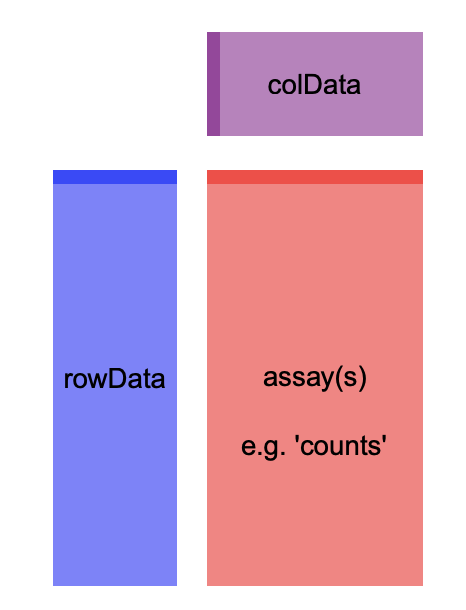

```{r setup, include=FALSE}
knitr::opts_chunk$set(echo = TRUE)
library(bookdown)
```
```{r libraries, include=FALSE}
library(knitr)
library(DESeq2)
library(gplots)
library(ggplot2)
library(htmlTable)
library(devtools)
library(BiocManager)
library(Biobase)
library(limma)
library(org.Hs.eg.db)
library(clusterProfiler)
library(enrichplot)
library(genefilter)
library(magrittr)
library(pheatmap)
library(RColorBrewer)
library(kableExtra)
```
```{r data, include=FALSE}
# Se cargan los datos
target<-read.csv("Data/targets.csv", row.names = 1, stringsAsFactors = FALSE)
counts<-read.csv("Data/counts.csv", sep = ";", row.names = 1)
rownames(counts)<-gsub("\\..*", "", rownames(counts), fixed = FALSE)
target$sex<-as.factor(target$sex)
target$Group<-as.factor(target$Group)
target$Grupo_analisis<-as.factor(target$Grupo_analisis)
str(target)
# Se dividen en subgrupos según el tipo de muestra
target.eli<-subset(target, subset=target$Group=="ELI")
target.nit<-subset(target, subset=target$Group=="NIT")
target.sfi<-subset(target, subset=target$Group=="SFI")
```
# Abstract

En el presente estudio se analiza la expresión diferencial de genes en muestras de tejido tiroideo con diferentes grados de infiltración linfocitaria.

En las muestras con mayor infiltración linfocitaria se detectó una mayor expresión de genes relacionados con las vías de citoquinas y de activación del sistema inmune. Un análisis específico de estos mecanismos moleculares podrián ser útil para una mejor compresión de esta patología y para estrategías terapéuticas.

## Repositoiro GitHub

https://github.com/joacoastete/PEC-2-Analisis-Datos-Omicos.git

# Objetivos

* Utilizar el paquete `DESeq2` para realizar un workflow para el análisis de datos de técnicas de **RNA-seq**

* Análisis de genes diferencialmente expresados en muestras de tejido tiroideo con infiltración linfocitaria

* Establecer que vías moleculares pueden estar involucradas en la fisiopatogenia de la infiltración linfocitaria

# Materiales y Métodos

## Datos

Los datos para la realización del estudio fueron obtenidos del repositorio **GTEx1** correspondientes a muestras de tejido tiroideo humano con infiltraciones linfocitarias. En dichas muestras se ha analizado la expresión génica a través de la tecnica de *RNA-seq*

El conjunto muestral total se compone de `r nrow(target)`, divididas en los siguientes grupos:

* Not infiltrated tissues (NIT): `r nrow(target.nit)` muestras
* Small focal infiltrates (SFI): `r nrow(target.sfi)` muestras
* Extensive lymphoid infiltrates (ELI): `r nrow(target.eli)` muestras

Para cada muestra se han analizado `r nrow(counts)` transcriptos.

En el presente estudio se han seleccionado aleatoriamente 10 muestras de cada grupo. Para dicha selección se ha utilizado el siguiente script en `R`. Para garantizar la reproducibilidad del estudio se ha seleccionado la semilla *2605*. 

```{r funcion seleccon}

# Se genera un vector con indices aleatorios
sel.ind<-function(x){
  ind<-sample(nrow(x),10)
  return(x[ind,])
}

# Se genera una función para la selección de columnas. 
# Dado que los archivos presentan simbolos diferentes de separación 
# en los nombres de muestras, se unifica.

sel.sample<-function(x){
  lista<-c()
  for (i in x$Sample_Name){
    nom<-paste0(unlist(strsplit(i, "-")), collapse = ".")
    lista<-c(lista,nom)
  }
  return(lista)
}

set.seed(2605)
# Aplica las funciones
target.sel.eli<-sel.ind(target.eli)
count.sel.eli<-counts[sel.sample(target.sel.eli)]
colnames(count.sel.eli)=paste0("eli", 1:10)
target.sel.nit<-sel.ind(target.nit)
count.sel.nit<-counts[sel.sample(target.sel.nit)]
colnames(count.sel.nit)=paste0("nit", 1:10)
target.sel.sfi<-sel.ind(target.sfi)
count.sel.sfi<-counts[sel.sample(target.sel.sfi)]
colnames(count.sel.sfi)=paste0("sfi", 1:10)

# Se cambia el nombre de las muestras para simplificarlos
target.sel.eli$Sample_Name<-c(paste0("eli", 1:10))
target.sel.nit$Sample_Name<-c(paste0("nit", 1:10))
target.sel.sfi$Sample_Name<-c(paste0("sfi", 1:10))
rownames(target.sel.eli)<-c(paste0("eli", 1:10))
rownames(target.sel.nit)<-c(paste0("nit", 1:10))
rownames(target.sel.sfi)<-c(paste0("sfi", 1:10))

# Se unifican los conjuntos de datos
targets.sel<-rbind(target.sel.eli,target.sel.nit,target.sel.sfi)
counts.sel<-cbind(count.sel.eli,count.sel.nit,count.sel.sfi)
```

## Diseño del experimento

Es un diseño de un factor con tres niveles. El factor es el tejido tiroideo, y los niveles son:

* Not infiltrated tissues (**NIT**)
* Small focal infiltrates (**SFI**)
* Extensive lymphoid infiltrates (**ELI**)

Para el estudio de expresión génica diferencial entre grupos se realizarán las siguientes comparaciones:

* **NIT** vs **SFI**
* **NIT** vs **ELI**
* **ELI** vs **SFI**

## Análisis de datos

Para la preparación de los datos, como para el análisis de los mismos se utilizó el paquete `DESeq2` a través del paquete `Bioconductor` en `R`.

Con la selección de datos se generaró un objeto ` SummarizedExperiment` que presenta la siguiente estructura [@love2014moderated]

```{r,fig.cap= "Estructura  SummarizedExperiment", fig.align="center", echo=FALSE}




```


El rectángulo rojo representa la matriz de datos, el azul representa lo información sobre los rangos genómicos y el púrpura representa la información sobre las muestras.

```{r ddsMat}
# Genera el objeto 'SummarizedExperiment'
ddsMat <- DESeqDataSetFromMatrix(countData = counts.sel, colData = targets.sel, 
                                 design = ~ Group)
``` 

```{r, include=FALSE}
# Filtra los genes que no tienen conteos
dds <- ddsMat[ rowSums(counts(ddsMat)) > 1, ]
```

Se han filtrado los genes que no presentaban ningún conteo, quedando un total de `r nrow(dds)` transcriptos para analizar.

Para el análisis de las distancia entre las muestras y el análisis del componente principal se ha utilizado la transformación *Variance Stabilizing Transformation* [@anders2010differential]

```{r vst, include=FALSE}
# Realiza la trasformación 'VST'
vsd <- vst(dds, blind = FALSE)
```

En el siguiente *HeatMap* se puede observar la distancia en contajes entre muestras

```{r dist, fig.align="center",fig.cap= "Distancia entre muestras", echo=FALSE, warning=FALSE}
# Calcula la distancia entre muestras y se genera el 'heatmap'
sampleDists <- dist(t(assay(vsd)))
sampleDistMatrix <- as.matrix( sampleDists )
rownames(sampleDistMatrix) <- vsd$Sample_Name
colnames(sampleDistMatrix) <- vsd$Sample_Name
colors <- colorRampPalette( rev(brewer.pal(9, "Blues")) )(255)
pheatmap(sampleDistMatrix,
         clustering_distance_rows = sampleDists,
         clustering_distance_cols = sampleDists,
         col = colors)
```

La mayor distancia se observa entre muestras del grupo **ELI** y el grupo **NIT**.

A continuación se muestra un gráfico de los componentes principales.

```{r PCA, fig.align="center",fig.cap= "Grafico PCA", echo=FALSE, warning=FALSE}
# Realiza el gráfico de PCA
plotPCA(vsd, intgroup = "Group")+ 
  geom_text(aes(label=vsd$Sample_Name),vjust=2)+
  xlim(-60, 60)+
  ylim(-30,30)+
  geom_hline(yintercept = 0, color = "gray70") +
  geom_vline(xintercept = 0, color = "gray70") +  
  ggtitle(paste("Analisis de Componente Principal"))+ 
  theme(plot.title = element_text(hjust = 0.5))
```

El principal componente de la varianza que explica un 60% de la misma podría ser la presencia de infiltración.

Para la realización de las comparaciones múltiples se ha utilizado el pipeline `DESeq` [@love2014moderated]. Para cada comparación entre los grupos se ha elegido un False Discovery Rate (FDR) de 0.05 [@Benjamini1995].

A los resultados obtenidos se le ha agregado las nomenclaturas de identificación *ENTREZ* y *SYMBOL* para cada gen según su identificación *ENSEMBL*.

Para el análisis de significación biológica, se ha realizado un *Over-Representation test* [@boyle2004go] con la base de datos de funciones moleculares de **GENE ONTOLOGY**, utilizando el paquete `clusterProfiler`. Para dicho análisis se ha utilizado un FDR de 0.1.

```{r deseq, include=FALSE}
# Aplica la función 'DESeq'
dds <- DESeq(dds)
```

```{r results, include=FALSE}
# Realiza las comparaciones entre grupos
res.elivssfi <- results(dds, contrast=c("Group","ELI","SFI"), alpha = 0.05)
res.elivsnit<- results(dds, contrast=c("Group","ELI","NIT"), alpha = 0.05)
res.sfivsnit<- results(dds, contrast=c("Group","SFI","NIT"), alpha = 0.05)
```

# Resultados

Para cada comparación se han obtenido las siguientes cantidades de genes expresados diferencialmente para un FDR de 0.05:

* **NIT** vs **SFI**: `r sum(res.sfivsnit$padj < 0.05, na.rm=TRUE)`
* **NIT** vs **ELI**: `r sum(res.elivsnit$padj < 0.05, na.rm=TRUE)`
* **ELI** vs **SFI**: `r sum(res.elivssfi$padj < 0.05, na.rm=TRUE)`

Se observa que no se han encontrado grandes diferencias entre el grupo *NIT* y el grupo *SFI*, pero se observa que el grupo *ELI* presenta una diferencia de expresión génica importante con los otros dos grupos.

A continuación se muestra un diagrama de Venn con los genes seleccionados en común entre las tres comparaciones

```{r venn, fig.cap=" Diagrama de Venn", echo=FALSE}
# Se generan vectores con los genes en común entre comparaciones
sig.1 <- na.omit(res.elivssfi[ which(res.elivssfi$padj < 0.05 ), ])
sig.1.genes<-rownames(sig.1)
sig.2 <- na.omit(res.elivsnit[ which(res.elivsnit$padj < 0.05 ), ])
sig.2.genes<-rownames(sig.2)
sig.3 <- na.omit(res.sfivsnit[ which(res.sfivsnit$padj < 0.05 ), ])
sig.3.genes<-rownames(sig.3)
comb<-c(sig.1.genes,sig.2.genes,sig.3.genes)
sig.1.genes.2<- comb %in% sig.1.genes
sig.2.genes.2<- comb %in% sig.2.genes
sig.3.genes.2<- comb %in% sig.3.genes
counts.venn<-cbind(sig.1.genes.2,sig.2.genes.2, sig.3.genes.2)
# Realiza el contaje para el diagrama
venn<-vennCounts(counts.venn)
# Realiza el gráfico
vennDiagram(venn, names=c("ELIvsSFI", "ELIvsNIT","SFIvsNIT"), 
            circle.col = c("red", "blue", "green"))
title("Genes seleccionados en comun entre comparaciones\n FDR < 0.05", 
    cex.main = 0.8)
```

El siguiente gráfico es un *HeatMap* en el que se observan los 20 transcriptos con mayor varianza luego de la transformación *Variance Stabilizing Transformation* y las muestras agrupados según similitud.

```{r, fig.cap= "Heatmap clustering", echo=FALSE}
topVarGenes <- head(order(rowVars(assay(vsd)), decreasing = TRUE), 20)
mat  <- assay(vsd)[topVarGenes, ]
mat  <- mat - rowMeans(mat)
anno <- as.data.frame(colData(vsd)[, c("Group")])
rownames(anno) <- colnames(vsd)
colnames(anno)<-"Group"
my_palette <- colorRampPalette(c("blue", "yellow"))(n = 299)
pheatmap(mat, annotation_col = anno, color=my_palette)
```

En los siguientes gráficos se muestra un *MAplot* [@yang2002normalization] para cada comparación realizada. 

Este tipo de representación es util para la comparación entre dos grupos. En el eje Y se representa el cambio de *Log2*, en el eje X la media de los contajes normalizados.  Los transcriptos son representados con puntos, los transcriptos con un p-valor ajustado menor a 0.05 son representados en rojo. Se ha remarcado en azul el transcripto con el menor p-valor ajustado para cada comparición.

```{r list of tables, include=FALSE}
# Agrega la nomenclatura 'SYMBOL' y 'ENTREZ' para cada gen
res.elivssfi$symbol <- mapIds(org.Hs.eg.db,keys=row.names(res.elivssfi),
                              column="SYMBOL",keytype="ENSEMBL", multiVals="first")
res.elivssfi$entrez <- mapIds(org.Hs.eg.db,keys=row.names(res.elivssfi),
                              column="ENTREZID",keytype="ENSEMBL", multiVals="first")
res.elivsnit$symbol <- mapIds(org.Hs.eg.db,keys=row.names(res.elivsnit),
                              column="SYMBOL",keytype="ENSEMBL", multiVals="first")
res.elivsnit$entrez <- mapIds(org.Hs.eg.db,keys=row.names(res.elivsnit),
                              column="ENTREZID",keytype="ENSEMBL", multiVals="first")
res.sfivsnit$symbol <- mapIds(org.Hs.eg.db,keys=row.names(res.sfivsnit),
                              column="SYMBOL",keytype="ENSEMBL", multiVals="first")
res.sfivsnit$entrez <- mapIds(org.Hs.eg.db,keys=row.names(res.sfivsnit),
                              column="ENTREZID",keytype="ENSEMBL", multiVals="first")

# Genera una lista con los resultados de cada comparación
listOfTables <- list(ELIvsSFI = res.elivssfi, 
                     ELIvsNIT  = res.elivsnit, 
                     SFIvsNIT = res.sfivsnit)
```

```{r MAplot, fig.cap=paste0("MAplot para la comparacion\n ",name), echo=FALSE}
# Realiza el MAplot para cada comparación
topGene<-c()
for (i in 1:length(listOfTables)){
  res<-listOfTables[[i]]
  name<-names(listOfTables)[i]
  topGene <- rownames(res)[which.min(res$padj)]
  DESeq2::plotMA(res, ylim=c(-5,5), main=paste0("MAplot para la comparacion\n ",name))
  with(res[topGene, ], {
    points(baseMean, log2FoldChange, col="dodgerblue", cex=2, lwd=2)
    text(baseMean, log2FoldChange, topGene, pos=2, col="dodgerblue")
  })
}
```

Se observa, como anteriormente, que no hay gran diferencia entre el grupo **NIT** y el grupo **SFI**, pero si el grupo **ELI** con los demás grupos.

A continuación se muestra dos tablas para cada comparación, una con los genes significativos que presentan una mayor *Up-regulation* y otra tabla con los genes significativos que presentan una mayor *Down-regulation*

```{r updown,results = "asis", echo=FALSE}

# Selecciona los genes y genera las tablas para cada comparación
for (i in 1:length(listOfTables)) {
  name<-names(listOfTables)[i]
  tab<-subset(listOfTables[[i]], padj < 0.05)
  tab.down<-as.data.frame(head(tab[order(tab$log2FoldChange), ]))
  tab.up<-head(tab[order(tab$log2FoldChange,decreasing =TRUE), ])
  print(knitr::kable(tab.down, format = "html", booktabs = T, 
                 caption = paste0(" Genes con down-regulation para la comparacion ", 
                                  name))%>%
    kable_styling(bootstrap_options = c("striped", "hover")))
  cat("\n")
    print(knitr::kable(tab.up, format = "html", booktabs = T, 
                 caption = paste0(" Genes con up-regulation para la comparacion ", 
                                  name))%>%
    kable_styling(bootstrap_options = c("striped", "hover")))
  cat("\n")
}
```

Para el análisis de significación biológica, se ha realizado un *Over-Representation test* con la base de datos de funciones moleculares de **GENE ONTOLOGY**. Se muestra una tabla y un gráfico para cada comparación con las principales vías moleculares obtenidas con el análsis realizado

```{r, fig.cap=paste0("Barplot Gene Enrichment Analysis - ",name), results = "asis", echo=FALSE}
# Realiza el 'Gene Enrich Analysis' para cada comparación
# Genera una tabla y barplot con los resultados

for (i in 1:length(listOfTables)) {
  gene.df<-cbind(listOfTables[[i]]$entrez,listOfTables[[i]]$log2FoldChange)
  gene.df<-na.omit(gene.df)
  geneList <- as.numeric(gene.df[,2])
  names(geneList) <- as.character(gene.df[,1])
  gene <- names(geneList)[abs(geneList) > 2]
  name<-names(listOfTables)[i]
  ego <- enrichGO(gene          = gene,
                  universe      = names(geneList),
                  OrgDb         = org.Hs.eg.db,
                  ont           = "MF",
                  pAdjustMethod = "BH",
                  pvalueCutoff  = 0.1,
                  qvalueCutoff  = 0.1)
  tab <- as.data.frame(ego@result)[1:5, 1:6]
  print(knitr::kable(tab,format = "html", booktabs = T, row.names = FALSE, 
                 caption = paste0(" GO over-representation test para la comparacion ", 
                                  name))%>%
    kable_styling(bootstrap_options = c("striped", "hover")))
  
  cat("\n")
  cat("\n")
  
  
  print(barplot(ego,
          title = paste0(" GO over-representation test para la comparacion\n ",
                               name),
                showCategory = 15, font.size = 10))
  
  
  cat("\n")
  cat("\n")
}

```

Se observa que en las comparaciones que contienen al grupo **ELI**, las vías moleculares implicadas estan relacionadas con vías de citoquinas y de activación del sistema inmune.
Mientras que las vías en la comparación **NIT** vs **SFI** están relacionadas con mecanismos neuroendocrinos.

# Discusión

En el presente trabajo se analizó las alteraciones de expresión génica que se pueden encontrar en tejido tiroideo con infiltración linfocitaria. La principal debilidad de este trabajo es el pequeño muestral ya que solo se analizaron 10 muestras en cada grupo. 

En el trabajo se detectaron alrededor de 4000 genes expresados diferencialmente en las muestras con mayor infiltración linfocitaria. Se mostró que vías relacionadas con las citoquinas y activación del sistema inmune podrían estar implicadas en la mayor infiltración. Se podría ampliar el estudio utilizando el resto de muestras para aumentar el tamaño muestral y así poder corroborar dicha hipótestis.

# Apéndice

Código `R`  utilizado para realizar el análisis

```{r apendice, eval=FALSE}

library(knitr)
library(DESeq2)
library(gplots)
library(ggplot2)
library(htmlTable)
library(devtools)
library(BiocManager)
library(Biobase)
library(limma)
library(org.Hs.eg.db)
library(clusterProfiler)
library(enrichplot)
library(genefilter)
library(magrittr)
library(pheatmap)
library(RColorBrewer)
library(kableExtra)

# Se cargan los datos
target<-read.csv("Data/targets.csv", row.names = 1, stringsAsFactors = FALSE)
counts<-read.csv("Data/counts.csv", sep = ";", row.names = 1)
rownames(counts)<-gsub("\\..*", "", rownames(counts), fixed = FALSE)
target$sex<-as.factor(target$sex)
target$Group<-as.factor(target$Group)
target$Grupo_analisis<-as.factor(target$Grupo_analisis)
str(target)
# Se dividen en subgrupos según el tipo de muestra
target.eli<-subset(target, subset=target$Group=="ELI")
target.nit<-subset(target, subset=target$Group=="NIT")
target.sfi<-subset(target, subset=target$Group=="SFI")

# Se genera un vector con indices aleatorios
sel.ind<-function(x){
  ind<-sample(nrow(x),10)
  return(x[ind,])
}

# Se genera una función para la selección de columnas. 
# Dado que los archivos presentan simbolos diferentes de separación 
# en los nombres de muestras, se unifica.
sel.sample<-function(x){
  lista<-c()
  for (i in x$Sample_Name){
    nom<-paste0(unlist(strsplit(i, "-")), collapse = ".")
    lista<-c(lista,nom)
  }
  return(lista)
}

set.seed(2605)
# Aplica las funciones
target.sel.eli<-sel.ind(target.eli)
count.sel.eli<-counts[sel.sample(target.sel.eli)]
colnames(count.sel.eli)=paste0("eli", 1:10)
target.sel.nit<-sel.ind(target.nit)
count.sel.nit<-counts[sel.sample(target.sel.nit)]
colnames(count.sel.nit)=paste0("nit", 1:10)
target.sel.sfi<-sel.ind(target.sfi)
count.sel.sfi<-counts[sel.sample(target.sel.sfi)]
colnames(count.sel.sfi)=paste0("sfi", 1:10)

# Se cambia el nombre de las muestras para simplificarlos
target.sel.eli$Sample_Name<-c(paste0("eli", 1:10))
target.sel.nit$Sample_Name<-c(paste0("nit", 1:10))
target.sel.sfi$Sample_Name<-c(paste0("sfi", 1:10))
rownames(target.sel.eli)<-c(paste0("eli", 1:10))
rownames(target.sel.nit)<-c(paste0("nit", 1:10))
rownames(target.sel.sfi)<-c(paste0("sfi", 1:10))

# Se unifican los conjuntos de datos
targets.sel<-rbind(target.sel.eli,target.sel.nit,target.sel.sfi)
counts.sel<-cbind(count.sel.eli,count.sel.nit,count.sel.sfi)


# Genera el objeto 
ddsMat <- DESeqDataSetFromMatrix(countData = counts.sel, colData = targets.sel, 
                                 design = ~ Group)
# Filtra los genes que no tienen conteos
dds <- ddsMat[ rowSums(counts(ddsMat)) > 1, ]

# Realiza las comparaciones entre grupos
res.elivssfi <- results(dds, contrast=c("Group","ELI","SFI"), alpha = 0.05)
res.elivsnit<- results(dds, contrast=c("Group","ELI","NIT"), alpha = 0.05)
res.sfivsnit<- results(dds, contrast=c("Group","SFI","NIT"), alpha = 0.05)

# Se generan vectores con los genes en común entre comparaciones
sig.1 <- res.elivssfi[ which(res.elivssfi$padj < 0.05 ), ]
sig.1.genes<-rownames(sig.1)
sig.2 <- res.elivsnit[ which(res.elivsnit$padj < 0.05 ), ]
sig.2.genes<-rownames(sig.2)
sig.3 <- res.sfivsnit[ which(res.sfivsnit$padj < 0.05 ), ]
sig.3.genes<-rownames(sig.3)
comb<-c(sig.1.genes,sig.2.genes,sig.3.genes)
sig.1.genes.2<- comb %in% sig.1.genes
sig.2.genes.2<- comb %in% sig.2.genes
sig.3.genes.2<- comb %in% sig.3.genes
counts.venn<-cbind(sig.1.genes.2,sig.2.genes.2, sig.3.genes.2)
# Realiza el contaje para el diagrama
venn<-vennCounts(counts.venn)
# Realiza el gráfico
vennDiagram(venn, names=c("ELIvsSFI", "ELIvsNIT","SFIvsNIT"), 
            circle.col = c("red", "blue", "green"))
title("Genes seleccionados en comun entre comparaciones\n FDR < 0.05", 
    cex.main = 0.8)

# Agrega la nomenclatura 'SYMBOL' y 'ENTREZ' para cada gen
res.elivssfi$symbol <- mapIds(org.Hs.eg.db,keys=row.names(res.elivssfi),
                              column="SYMBOL",keytype="ENSEMBL", multiVals="first")
res.elivssfi$entrez <- mapIds(org.Hs.eg.db,keys=row.names(res.elivssfi),
                              column="ENTREZID",keytype="ENSEMBL", multiVals="first")
res.elivsnit$symbol <- mapIds(org.Hs.eg.db,keys=row.names(res.elivsnit),
                              column="SYMBOL",keytype="ENSEMBL", multiVals="first")
res.elivsnit$entrez <- mapIds(org.Hs.eg.db,keys=row.names(res.elivsnit),
                              column="ENTREZID",keytype="ENSEMBL", multiVals="first")
res.sfivsnit$symbol <- mapIds(org.Hs.eg.db,keys=row.names(res.sfivsnit),
                              column="SYMBOL",keytype="ENSEMBL", multiVals="first")
res.sfivsnit$entrez <- mapIds(org.Hs.eg.db,keys=row.names(res.sfivsnit),
                              column="ENTREZID",keytype="ENSEMBL", multiVals="first")

# Genera una lista con los resultados de cada comparación
listOfTables <- list(ELIvsSFI = res.elivssfi, 
                     ELIvsNIT  = res.elivsnit, 
                     SFIvsNIT = res.sfivsnit)

# Realiza el MAplot para cada comparación
topGene<-c()
for (i in 1:length(listOfTables)){
  res<-listOfTables[[i]]
  name<-names(listOfTables)[i]
  topGene <- rownames(res)[which.min(res$padj)]
  DESeq2::plotMA(res, ylim=c(-5,5), main=paste0("MAplot para la comparacion\n ",name))
  with(res[topGene, ], {
    points(baseMean, log2FoldChange, col="dodgerblue", cex=2, lwd=2)
    text(baseMean, log2FoldChange, topGene, pos=2, col="dodgerblue")
  })
}

# Selecciona los genes y genera las tablas para cada comparación
for (i in 1:length(listOfTables)) {
  name<-names(listOfTables)[i]
  tab<-subset(listOfTables[[i]], padj < 0.05)
  tab.down<-as.data.frame(head(tab[order(tab$log2FoldChange), ]))
  tab.up<-head(tab[order(tab$log2FoldChange,decreasing =TRUE), ])
  print(knitr::kable(tab.down, format = "html", booktabs = T, 
                 caption = paste0(" Genes con down-regulation para la comparacion ", 
                                  name))%>%
    kable_styling(bootstrap_options = c("striped", "hover")))
  cat("\n")
    print(knitr::kable(tab.up, format = "html", booktabs = T, 
                 caption = paste0(" Genes con up-regulation para la comparacion ", 
                                  name))%>%
    kable_styling(bootstrap_options = c("striped", "hover")))
  cat("\n")
}

# Realiza el 'Gene Enrich Analysis' para cada comparación
# Genera una tabla y barplot con los resultados
for (i in 1:length(listOfTables)) {
  gene.df<-cbind(listOfTables[[i]]$entrez,listOfTables[[i]]$log2FoldChange)
  gene.df<-na.omit(gene.df)
  geneList <- as.numeric(gene.df[,2])
  names(geneList) <- as.character(gene.df[,1])
  gene <- names(geneList)[abs(geneList) > 2]
  name<-names(listOfTables)[i]
  ego <- enrichGO(gene          = gene,
                  universe      = names(geneList),
                  OrgDb         = org.Hs.eg.db,
                  ont           = "MF",
                  pAdjustMethod = "BH",
                  pvalueCutoff  = 0.1,
                  qvalueCutoff  = 0.1)
  tab <- as.data.frame(ego@result)[1:5, 1:6]
  print(knitr::kable(tab,format = "html", booktabs = T, row.names = FALSE, 
                 caption = paste0(" GO over-representation test para la comparacion ", 
                                  name))%>%
    kable_styling(bootstrap_options = c("striped", "hover")))
  
  cat("\n")
  cat("\n")
  print(barplot(ego,
          title = paste0(" GO over-representation test para la comparacion\n ",
                               name),
                showCategory = 15, font.size = 10))
  cat("\n")
  cat("\n")
}

```


# Referencias